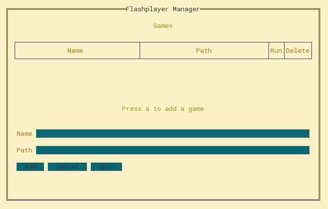

# fp_manage

A command line interface to manage your flash games. Disclaimer: not yet tested on windows or macOS, but I doubt it'll work in those anyway.

## Usage

First, download some flash games. These will come in files that end in `.swf`. Next, install the `flashplayer` command. You're going to want the *Standalone Flash Player*, also called *Flash Player Projector*. Finally, download `fp_manage` and run it in your terminal.

You will be greeted with a screen that looks like this:

You can press the `a` key to add a game. You can then maneuver around the fields of the form using `Tab` and `Shift-Tab`. Enter the name you want the game to be displayed as and the path to it's `swf` file in the fields, and then press enter on the `Add` button to add it to the table.

> Note: The `path` variable supports using things like `~/` or `$HOME/`

Finally, you can use the arrow keys to move around the table, and you can select Run and Delete to run or delete the game in question. Press `q` or `Escape` to quit the program once you're done.

## Another screenshot

Here's a photo of the thing in full action!

